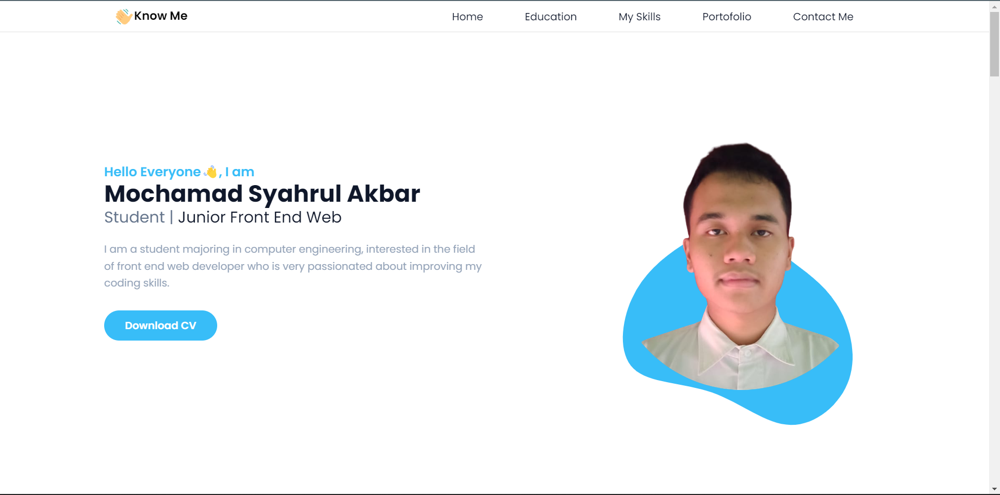

# **Final Course HTML & CSS**

## Website Portofolio

### Acceptance Criteria

- [x] Menggunakan Git sebagai repositori kerja
- [x] Menggunakan Tailwind CSS
- [x] Deployment ke Netlify
- [x] Memiliki 3 section (personal info, pendidikan, portofolio)
- [x] Responsive di berbagai dimensi layar

Build with :  
 

Big Thanks :  

1. Mentor and Mentee [Ruangguru](https://www.ruangguru.com/) x [Kampus Merdeka](https://kampusmerdeka.kemdikbud.go.id/) Studi Independent
2. Bapak Sandhika Galih and Tim at [Discord WPU](https://discord.gg/S4rrXQU/)
